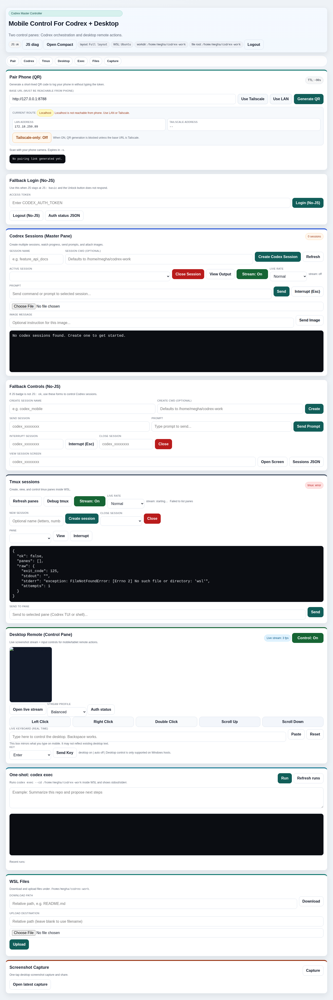
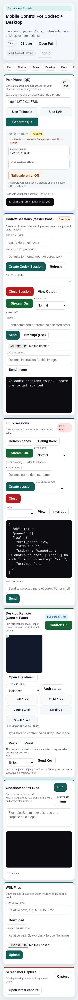
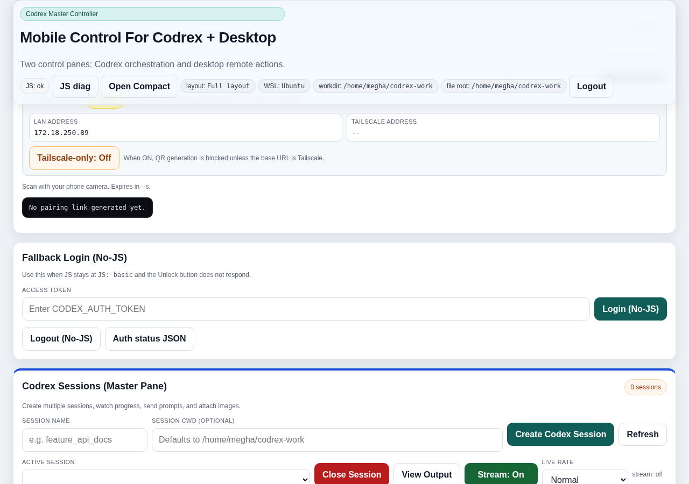

# Codrex


Codrex is a Windows + WSL remote control panel for managing Codex CLI sessions, tmux panes, and desktop actions from a browser.

It is designed for:
- Desktop control from your main machine
- Mobile/tablet control through a compact UI (`/mobile`)
- Secure pairing via short-lived QR code links
- Optional startup + watchdog automation on Windows

## Release Assets

- Current version: `1.3.0` (see `VERSION`)
- Changelog: `CHANGELOG.md`
- Runtime dependencies: `requirements.txt`

## One-Command Installer (Desktop)

From PowerShell in `C:\codrex-remote-ui`:

```powershell
powershell -NoProfile -ExecutionPolicy Bypass -File .\setup.ps1 -OpenFirewall
```

What this does:
- Creates `.venv` if missing
- Installs/updates Python dependencies
- Starts Codrex with your selected config
- Optionally opens firewall access for the configured port

## Quick Start (Fresh Machine)

```powershell
git clone git@github.com:meghamsh738/Codrex.git C:\codrex-remote-ui
Set-Location C:\codrex-remote-ui
powershell -NoProfile -ExecutionPolicy Bypass -File .\setup.ps1 -OpenFirewall
```

Then open:
- `http://127.0.0.1:8787`

## Screenshots

### Desktop UI



### Mobile UI



### Pairing Panel



## Project Layout

- `app/server.py`: FastAPI server and web UI
- `tests/test_run_wsl_bash.py`: unit tests for Windows/WSL command behavior
- `setup.ps1`: one-command bootstrap (venv, deps, startup)
- `start-controller.ps1`: starts the Codrex service
- `stop-controller.ps1`: stops the service
- `controller-launcher.ps1`: WinForms launcher for quick access + pairing
- `install-autostart.ps1`: installs startup + watchdog scheduled tasks
- `uninstall-autostart.ps1`: removes scheduled tasks
- `watchdog-controller.ps1`: health check + restart loop
- `controller.config.json`: runtime config (port, distro, workdir, token)

## Versioning Policy

Codrex follows Semantic Versioning:
- `MAJOR`: incompatible behavior changes
- `MINOR`: new backward-compatible features
- `PATCH`: bug fixes and doc-only corrections

Release housekeeping:
1. Update `VERSION`
2. Update `CHANGELOG.md`
3. Align API metadata in `app/server.py` (`FastAPI(... version=...)`)

## Prerequisites

### Desktop (Windows host)

- Windows 10/11
- PowerShell 5+
- Python 3.11+ (installed on Windows)
- WSL with your distro installed (default `Ubuntu`)
- `tmux` installed in WSL
- Codex CLI installed in WSL and available on PATH

### Mobile access

- Phone/tablet on same LAN or reachable through Tailscale
- Browser with camera support (for QR scan flow)

## Desktop Setup (Manual Path)

1. Place the project at:
   - `C:\codrex-remote-ui`
2. Open PowerShell in `C:\codrex-remote-ui`.
3. Create virtual env and install dependencies:

```powershell
py -3 -m venv .venv
.\.venv\Scripts\Activate.ps1
pip install -r requirements.txt
```

4. Review `controller.config.json`:

```json
{
  "port": 8787,
  "distro": "Ubuntu",
  "workdir": "/home/megha/codrex-work",
  "fileRoot": "/home/megha/codrex-work",
  "token": ""
}
```

Notes:
- Leave `token` empty for no-auth local setup.
- Set `token` to a strong random string to require login.
- `fileRoot` is the WSL-safe root for file upload/download operations.

5. Start Codrex:

```powershell
.\start-controller.ps1 -OpenFirewall
```

6. Optional launcher UI:

```powershell
.\controller-launcher.ps1
```

Or double-click:
- `Controller Launcher.cmd`

## Mobile Setup and Pairing Tutorial

1. Start Codrex from desktop (`start-controller.ps1` or `setup.ps1`).
2. From desktop browser, open:
   - `http://<desktop-ip>:8787`
3. In the **Pair** section:
   - Select `Use LAN` or `Use Tailscale`
   - Click `Generate QR`
4. Scan QR code with your phone.
5. Phone opens pairing URL and sets auth cookie automatically.
6. Open compact mobile mode:
   - `http://<desktop-ip>:8787/mobile`

If you enabled a token:
- Desktop can still login manually in the auth panel.
- Mobile can pair without typing the long token via QR code.

## Day-to-Day Workflow Tutorial

1. Start service:

```powershell
.\start-controller.ps1
```

2. Open Codrex UI in browser:
- `http://127.0.0.1:8787`

3. In **Codrex Sessions**:
- Create a session
- Pick session from dropdown
- Send prompts/commands
- Use stream mode for live output

4. In **tmux panes**:
- Inspect panes
- Send text/keys
- Capture pane output

5. In **Desktop Control**:
- Toggle desktop mode
- Use click/scroll/key/text controls
- Capture screenshots from `/desktop/shot`

6. Stop when done:

```powershell
.\stop-controller.ps1
```

## Enable Auto Start + Watchdog

Install scheduled tasks:

```powershell
.\install-autostart.ps1
```

This creates:
- `CodrexRemoteController.Startup`
- `CodrexRemoteController.Watchdog`

Remove tasks:

```powershell
.\uninstall-autostart.ps1
```

## Running Tests

From repo root:

```bash
python -m unittest discover -s tests -v
```

The tests include stubs for FastAPI and MSS, so they validate command logic without requiring a full GUI runtime.

## Troubleshooting

- `Python executable not found at ...\.venv\Scripts\python.exe`:
  - Create the venv in the project root and install requirements.

- Mobile cannot reach desktop URL:
  - Use LAN IP (not localhost) or Tailscale IP.
  - Open firewall on chosen port.

- Pairing code fails:
  - Codes are short-lived and one-time use.
  - Generate a fresh QR code.

- Desktop stream errors when running on non-Windows hosts:
  - Desktop control endpoints require Windows host APIs.

## Security Notes

- Token auth is cookie-based (`codrex_remote_auth` by default).
- Pairing codes are one-time and expire quickly.
- Restrict `fileRoot` to the minimum required WSL path.
- Do not commit production secrets in `controller.config.json`.
