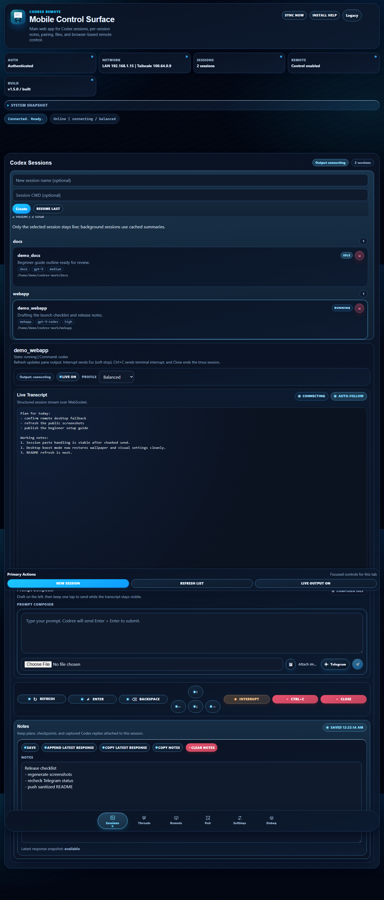
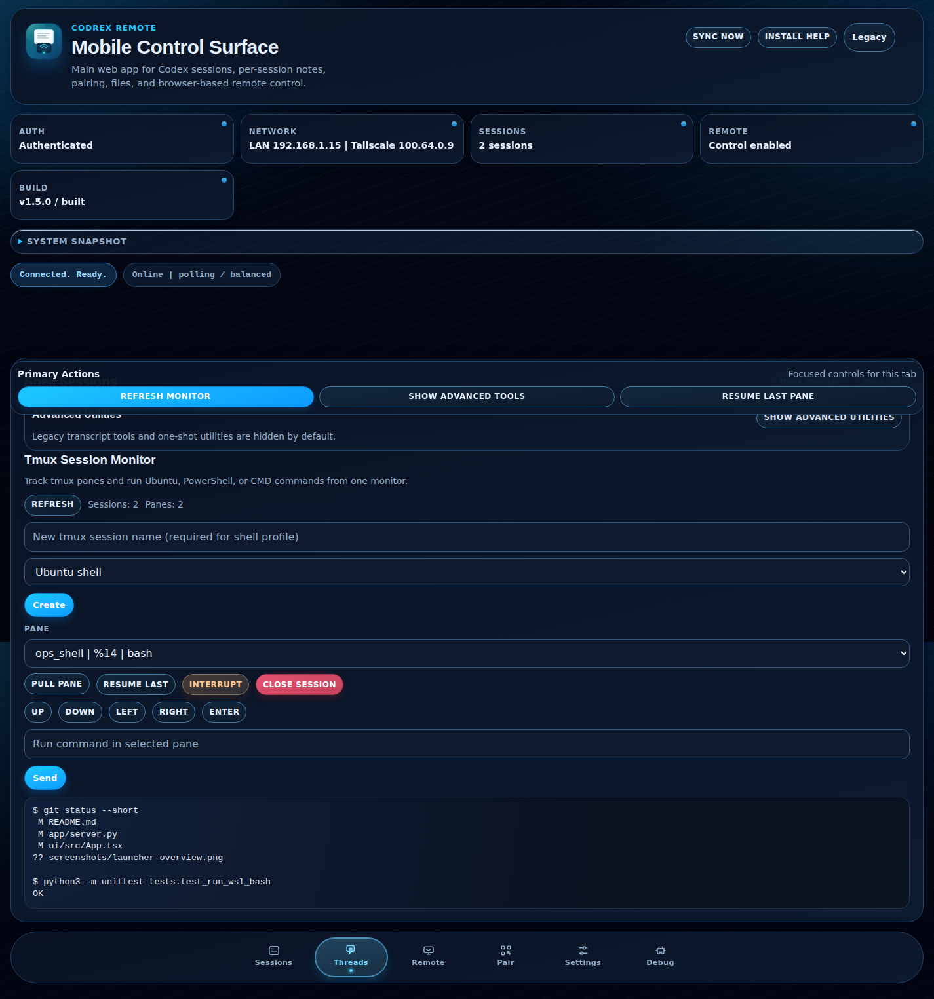
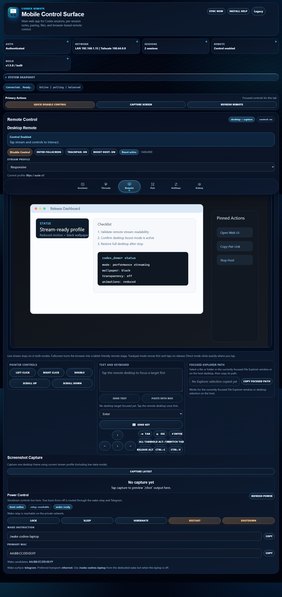
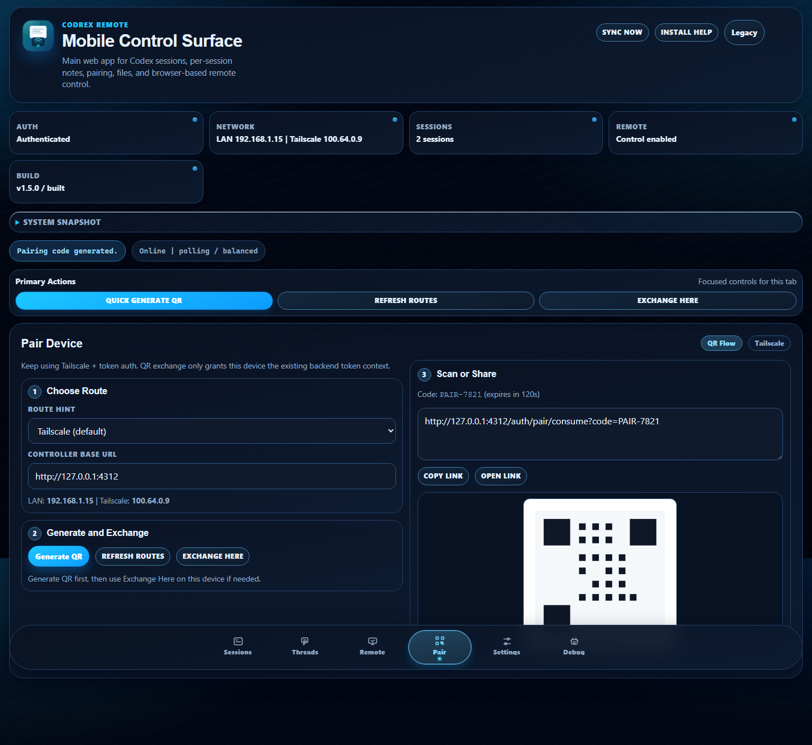
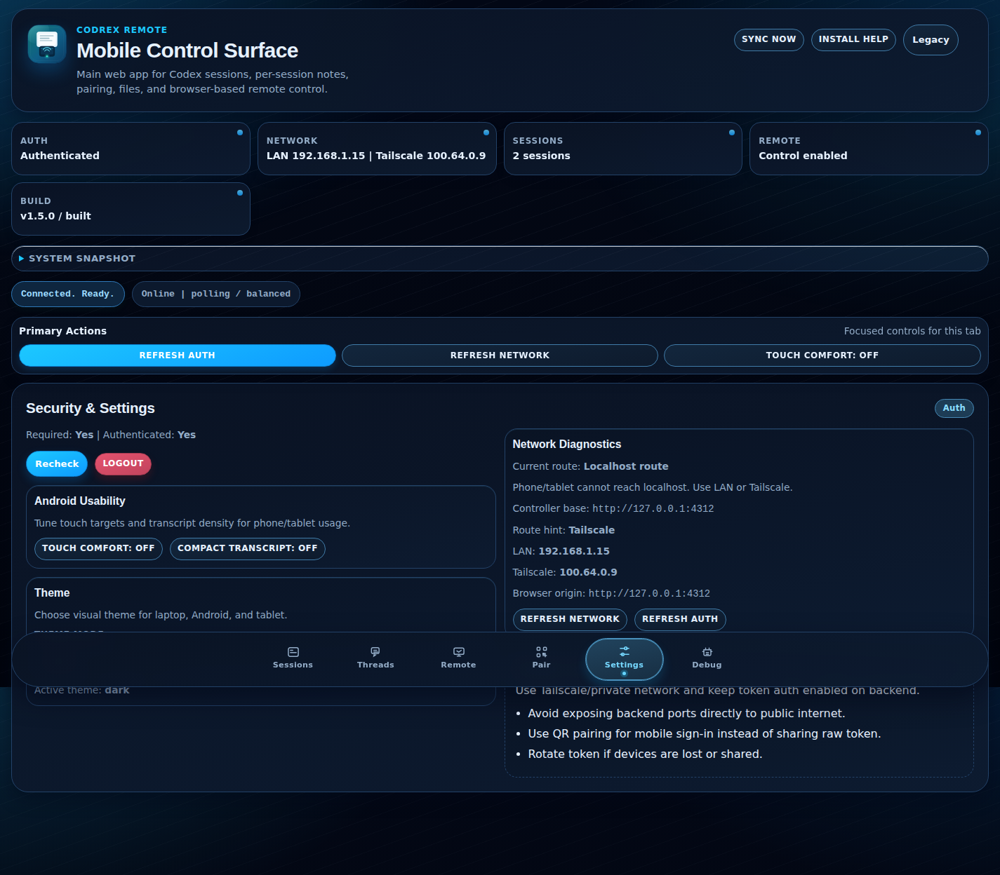
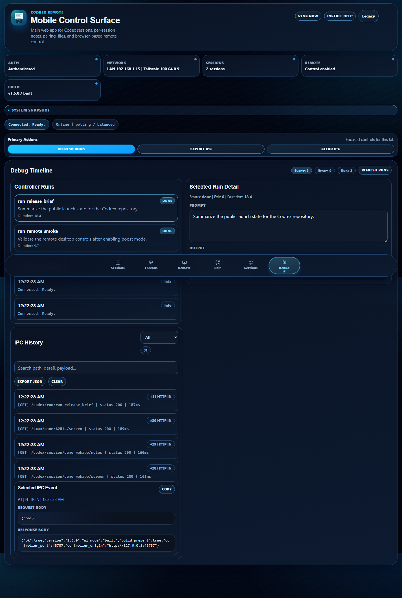

# Codrex


Codrex is a Windows + WSL remote control app for Codex CLI sessions, tmux shells, and desktop control from laptop, mobile, and tablet.

It includes:
- mobile-first web UI (`/mobile` React/PWA)
- pairing flow with short-lived QR codes
- Codex session control, shell session monitor, and remote desktop controls
- optional Telegram delivery pipeline for generated files

## Screenshots

### WebUI Tabs (Latest)

#### Sessions


#### Threads


#### Remote


#### Pair


#### Settings


#### Debug


## A-to-Z Setup (Fresh Clone)

### 1) Prerequisites

On Windows host:
- Windows 10/11
- WSL2 with Ubuntu distro installed
- Python 3.11+ (Windows)
- Node.js 20+ (Windows)
- npm 9+ (Windows)
- Git

Optional but recommended:
- Tailscale for private remote access
- Telegram app + BotFather (if you want file delivery via Telegram)

### 2) Clone

```powershell
git clone git@github.com:meghamsh738/Codrex.git "E:\coding projects\codex-remote-ui"
Set-Location "E:\coding projects\codex-remote-ui"
```

### 3) Prepare WSL workdir

```powershell
wsl -d Ubuntu -- bash -lc "mkdir -p /home/megha/codrex-work/output"
```

If your Linux username is not `megha`, replace the path in config accordingly.

### 4) First bootstrap

Double-clickable Windows bootstrap:
- `Setup.cmd`

Command-line equivalent:

```powershell
powershell -NoProfile -ExecutionPolicy Bypass -File .\setup.ps1 -OpenFirewall
```

What this does:
- creates/updates `.venv`
- installs Python deps
- installs UI deps
- builds the React app
- starts controller
- can open firewall rule for the configured port

### 5) Start full mobile stack

```powershell
Set-Location "E:\coding projects\codex-remote-ui"
.\Codrex.cmd
```

Primary Windows launcher:
- `Codrex.cmd`

Expected URLs:
- App + controller: `http://<your-lan-ip>:8787`
- Legacy fallback controls: `http://<your-lan-ip>:8787/legacy`

### 6) Auth and pairing

On laptop browser:
1. Open `http://127.0.0.1:8787`
2. Go to **Pair** tab
3. Keep **Tailscale** route (default and recommended)
4. Generate QR
5. Scan on phone/tablet

Important:
- `controller.config.json` ships with empty token; `start-controller.ps1` auto-generates a strong token on first run.
- Generated token is stored in `%LocalAppData%\Codrex\remote-ui\state\controller.config.local.json`.
- Pair QR uses short-lived one-time code exchange and does not place the long token in URL.
- LAN/current pairing routes are intentionally restricted for localhost browser sessions only.
- `/docs`, `/redoc`, and `/openapi.json` are auth-protected whenever auth is enabled.
- built app health is exposed at `/app/health` for the Windows launcher
- Runtime logs and mobile session state also live under `%LocalAppData%\Codrex\remote-ui\`.

### 7) Telegram delivery (optional)

Create bot with BotFather, then save token locally:

```powershell
New-Item -ItemType Directory -Force -Path "$env:LocalAppData\Codrex\remote-ui\secrets\telegram" | Out-Null
Set-Content -Path "$env:LocalAppData\Codrex\remote-ui\secrets\telegram\key.txt" -Value "<BOT_TOKEN>"
```

Send one message to your bot from your Telegram account, then restart stack:

```powershell
.\tools\windows\stop-mobile.ps1
.\Codrex.cmd
```

Verify from browser:
- `GET /telegram/status` should show `configured: true`

### 8) Use Codex + shell monitors

- **Sessions tab**: Codex sessions with smoother incremental streaming, session-scoped file attachments, `Copy Path`, `Use Path`, and `Send via Telegram`
- **Threads tab**: tmux shell monitor (Ubuntu/PowerShell/CMD panes)
- **Remote tab**: desktop controls, screenshot capture, and power/wake diagnostics
- **Pair tab**: QR auth/pairing

### 9) Session files and Telegram send

Use the `Files` panel in the selected session to:
- upload a file directly into that session
- attach an existing file or folder from the browser
- copy the translated WSL path and reuse it in prompts
- send a selected file to Telegram from the UI without typing a custom instruction

Session uploads are isolated per Codex session under:

```text
/home/megha/codrex-work/.remote_uploads/<session>/
```

You can still send files from inside the Codex session with the CLI helper:

```bash
tgsend "/home/megha/codrex-work/output/result.png" --title "Result" --expires 24
```

Alias also supported:

```bash
codrex-send "/home/megha/codrex-work/output/result.png" --title "Result" --expires 24
```

When Telegram is configured, `codrex-send` defaults to Telegram send if `telegramDefaultSend` is enabled.

### 10) Remote power and wake relay

The **Remote** tab exposes desktop power actions (`lock`, `sleep`, `hibernate`, `restart`, `shutdown`) and a wake diagnostics card.

Important:
- wake from off/sleep is **best effort** and depends on hardware, BIOS/UEFI, driver, and adapter power settings
- the web UI does **not** wake the laptop directly; wake runs through the separate always-on relay in `tools/wake-relay/`
- Wi-Fi wake should not be assumed on laptops; Ethernet is usually the only reliable path

The power card now reports:
- relay reachability
- wake readiness: `ready`, `partial`, or `unsupported`
- preferred transport hint: `ethernet`, `wifi`, or `unknown`
- a machine-specific warning when wake is not confirmed

Maintainer note:
- on the current `Acer Predator Helios 300 G3-572`, the present Windows adapter state does not confirm Wake-on-LAN support
- do not rely on Wi-Fi wake on that machine; Ethernet would be the first thing to test if wake is ever needed

## Daily Operations

Start:

```powershell
Set-Location "E:\coding projects\codex-remote-ui"
.\Codrex.cmd
```

Stop:

```powershell
Set-Location "E:\coding projects\codex-remote-ui"
.\tools\windows\stop-mobile.ps1
```

Primary launcher:
- `Codrex.cmd`

Advanced Windows tools:
- `tools/windows/`
- `tools/windows/legacy-launchers/` keeps the older `.cmd` wrappers for compatibility only
- `http://127.0.0.1:8787/legacy` stays available as the no-JS fallback if the built app is missing

## Windows App Layout

The repo root is intentionally simplified:
- use `Setup.cmd` for first-time machine bootstrap
- use `Codrex.cmd` for daily launch
- use `tools/windows/` only for advanced utilities, tray mode, controller-only tools, or autostart setup

## Security Checklist (Recommended)

1. Keep auth enabled (`%LocalAppData%\Codrex\remote-ui\state\controller.config.local.json` should contain a non-empty `token` after first start).
2. Prefer Tailscale/private LAN; do not expose controller/UI ports directly to public internet.
3. Use Pair QR from an authenticated laptop session only.
4. Keep Telegram secrets under `%LocalAppData%\Codrex\remote-ui\secrets\telegram\` only.
5. Rotate token if machine is shared or token was exposed.
6. Keep firewall rules scoped to trusted network profiles.
7. Keep `CODEX_COOKIE_SECURE=auto` (default). Use `always` behind HTTPS reverse proxies; avoid `never` except local HTTP testing.

## Known Security Risks

- If ports `8787`/`4312` are exposed to the public internet, attack surface increases significantly.
- If someone gets local filesystem access, they can read local runtime secrets and logs.
- Pair links are short-lived but still sensitive while valid; share only in trusted context.
- Telegram delivery sends files to the configured chat ID; treat bot token as a secret.
- If `CODEX_COOKIE_SECURE=never` is used on untrusted networks, auth-cookie interception risk increases.

## Feature Notes

- Reasoning options are model-aware (Codex-family models only support `low|medium|high`).
- Remote stream profiles include `Extreme` for very low bandwidth.
- `?tab=<name>` deep-link is supported for direct opening of tabs (`sessions`, `threads`, `remote`, `pair`, `settings`, `debug`).
- Desktop control mode is server-enforced globally; when disabled, input endpoints are blocked while live stream remains available in view-only mode.

## Development

Backend tests:

```bash
cd /mnt/c/codex-remote-ui
python3 -m unittest tests.test_run_wsl_bash
```

Frontend checks:

```bash
cd /mnt/c/codex-remote-ui/ui
npm run lint
npm run test
```

## Versioning

- Current release metadata: `VERSION` and `CHANGELOG.md`
- Changelog format: Keep a Changelog
