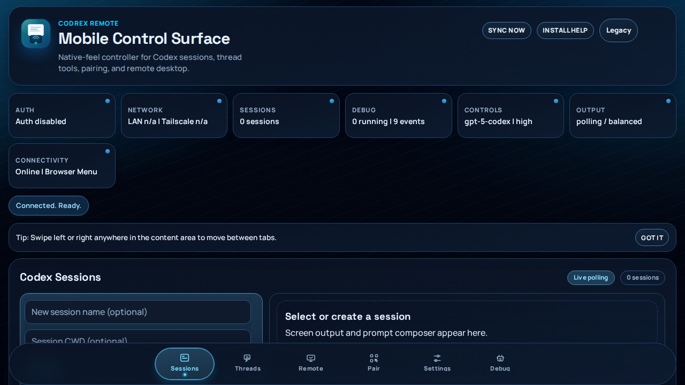
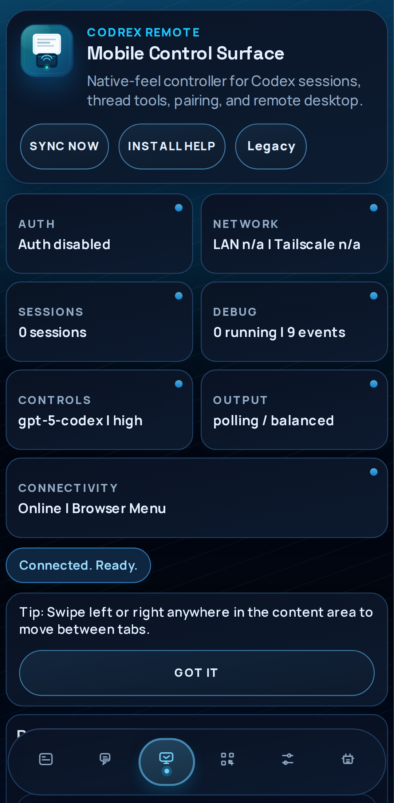

# Codrex


Codrex is a Windows + WSL remote control panel for managing Codex CLI sessions, tmux panes, and desktop actions from a browser.

It is designed for:
- Desktop control from your main machine
- Mobile/tablet control through a compact UI (`/mobile`)
- Secure pairing via short-lived QR code links
- Optional startup + watchdog automation on Windows

## Release Assets

- Current version: `1.4.1` (see `VERSION`)
- Changelog: `CHANGELOG.md`
- Runtime dependencies: `requirements.txt`

## One-Command Installer (Desktop)

From PowerShell in `C:\codrex-remote-ui`:

```powershell
powershell -NoProfile -ExecutionPolicy Bypass -File .\setup.ps1 -OpenFirewall
```

What this does:
- Creates `.venv` if missing
- Installs/updates Python dependencies
- Starts Codrex with your selected config
- Optionally opens firewall access for the configured port

## Quick Start (Fresh Machine)

```powershell
git clone git@github.com:meghamsh738/Codrex.git C:\codrex-remote-ui
Set-Location C:\codrex-remote-ui
powershell -NoProfile -ExecutionPolicy Bypass -File .\setup.ps1 -OpenFirewall
```

Then open:
- `http://127.0.0.1:8787`

## Experimental Mobile UI (React/PWA)

Codrex now includes an incremental mobile-first frontend in `ui/` that runs side-by-side with the existing FastAPI-rendered page.

Current slice focuses on:
- Auth status/login/logout
- Pairing QR generation and exchange
- Codex session list/create/send/interrupt/ctrl-c
- Live session screen polling
- Debug timeline (app events + `/codex/runs` history inspector)
- Prompt control profiles (Direct / Plan First / Build Focus + Reasoning depth)
- Session organization (project grouping, search, filter)
- Live output feed controls (SSE stream with polling fallback profiles)
- Android install flow (Install App button + fallback install guide)
- Connectivity chip (online/offline + install readiness)
- Quick action chips for common prompt workflows
- Scan-to-open app QR (LAN/Tailscale route-aware launch link)
- Console focus mode (full-screen terminal view on mobile)
- Sticky session action dock (Pull/Interrupt/Ctrl+C/Send for one-hand use)
- Swipe gestures for tab switching (left/right on content area)
- Touch feedback animation on tap targets (haptic-like visual press)
- One-time swipe hint banner (auto-dismiss on first swipe or manual "Got it")
- Bottom navigation with icons + larger touch targets
- Directional tab transition animations (subtle left/right slide)
- Refined visual system (cleaner typography, spacing rhythm, and card hierarchy)
- Unified branding via app icon in header + install surfaces
- Android PWA icon set (any + maskable + apple-touch) for native-style install polish
- Shared Files Inbox with deterministic `codrex-send` command interception and mobile download links

Run it:

```bash
cd ui
npm install
npm run dev
```

Open:
- `http://127.0.0.1:4312`

Notes:
- This UI proxies to backend `http://127.0.0.1:8787` by default.
- Set `VITE_BACKEND_ORIGIN` if your backend is running on another host/port.
- Legacy UI remains available at `http://127.0.0.1:8787/?compact=1`.
- If the app was already installed before icon updates, uninstall/reinstall once so Android refreshes cached manifest assets.

### Deterministic File Sharing (Recommended)

You can share files to phone/tablet inbox without relying on prompt memory:

- In a Codex session composer, run:
  - `codrex-send "/home/megha/codrex-work/output/result.png" --title "Result" --expires 24`
- The backend intercepts this command and writes a share entry to outbox.
- Mobile WebUI shows it under **Shared Files Inbox** with:
  - open/download,
  - copy link,
  - remove.

Supported command aliases:
- `codrex-send ...`
- `/codrex-send ...`
- `/send-file ...`
- `/share-file ...`

### One-Command Mobile Start (Windows)

Start backend + mobile UI together:

```powershell
Set-Location C:\codex-remote-ui
.\start-mobile.ps1
```

Or double-click:
- `Start Mobile.cmd`

Stop both:

```powershell
Set-Location C:\codex-remote-ui
.\stop-mobile.ps1
```

Or double-click:
- `Stop Mobile.cmd`

Notes:
- `start-mobile.ps1` reads backend port from `controller.config.json`.
- UI defaults to port `4312` (override with `-UiPort`).
- Add `-OpenFirewall` on first run if you need LAN access (opens both controller `8787` and UI `4312` rules).

### Mobile App Launcher (Windows, Recommended)

Use the app-style launcher window instead of tray menus:

```powershell
Set-Location C:\codex-remote-ui
.\mobile-launcher.ps1
```

Or double-click:
- `Start Mobile App.cmd`

Features in the launcher window:
- Start/Stop Mobile Stack
- Open app locally or on network
- Generate pair QR for phone/tablet login
- Copy/open pair link
- Live status + event log
- Localhost auth bootstrap (no manual token entry in launcher)

### System Tray Launcher (Windows)

Run a tray app with one-click Start/Stop and quick links:

```powershell
Set-Location C:\codex-remote-ui
.\mobile-tray.ps1
```

Or double-click:
- `Mobile Tray.cmd`

Tray menu actions:
- Start Mobile Stack
- Stop Mobile Stack
- Show Pair QR (mobile login without typing token)
- Open Mobile UI (local/network)
- Open Controller UI
- Open Logs Folder

## Security Model for Remote Access

Recommended setup for phone/tablet:
- Enable token auth in `controller.config.json` by setting a strong `token`.
- Keep Codrex reachable only through Tailscale (or another private VPN).
- Use short-lived QR pairing from an already-authenticated device.

Launcher auth behavior:
- The Windows launcher first attempts `/auth/bootstrap/local` on `localhost`.
- If local bootstrap is not available, it falls back to token login using `controller.config.json`.
- QR generation does not expose the long token in the mobile/browser URL.

Behavior details:
- `/auth/pair/create` requires an authenticated request when token auth is enabled.
- `/auth/pair/exchange` is public by design, but only accepts valid one-time, short-lived codes.
- Pairing links do not expose the long auth token to the browser.

Avoid:
- Exposing port `8787` directly to the public internet.
- Running no-token mode on untrusted networks.

## Screenshots

### Desktop UI



### Mobile UI



### Pairing Panel


## 1.4.0 Highlights

- Modern mobile/PWA web UI added under `ui/` with tabbed Sessions, Threads, Remote, Pair, Settings, and Debug views.
- Image upload flow supports three delivery modes:
  - insert local path into composer (no auto-send),
  - desktop clipboard paste (`Ctrl+V`),
  - send path as immediate session message.
- Codex model/reasoning guardrails:
  - codex-family models are clamped to supported reasoning levels,
  - stale sessions auto-repair profile before sends to avoid `unsupported_value` errors.
- Android-first UX improvements:
  - stronger dark theme polish,
  - larger touch targets and improved panel layout,
  - pairing and route diagnostics improvements.
- Remote desktop improvements:
  - faster default stream behavior and lower background polling load,
  - tap-to-focus before typing,
  - low-data `Ultra` stream profile (grayscale + downscale),
  - Remote screenshot capture now uses desktop frame capture path.

## 1.4.1 Incremental Update

- Added `Extreme` stream profile for unstable links:
  - very low frame rate,
  - maximum downscale,
  - grayscale mode.
- Intended for "see enough to navigate" use cases where responsiveness is more important than visual fidelity.

## Project Layout

- `app/server.py`: FastAPI server and web UI
- `tests/test_run_wsl_bash.py`: unit tests for Windows/WSL command behavior
- `setup.ps1`: one-command bootstrap (venv, deps, startup)
- `start-controller.ps1`: starts the Codrex service
- `stop-controller.ps1`: stops the service
- `controller-launcher.ps1`: WinForms launcher for quick access + pairing
- `install-autostart.ps1`: installs startup + watchdog scheduled tasks
- `uninstall-autostart.ps1`: removes scheduled tasks
- `watchdog-controller.ps1`: health check + restart loop
- `controller.config.json`: runtime config (port, distro, workdir, token)

## Versioning Policy

Codrex follows Semantic Versioning:
- `MAJOR`: incompatible behavior changes
- `MINOR`: new backward-compatible features
- `PATCH`: bug fixes and doc-only corrections

Release housekeeping:
1. Update `VERSION`
2. Update `CHANGELOG.md`
3. Align API metadata in `app/server.py` (`FastAPI(... version=...)`)

## Prerequisites

### Desktop (Windows host)

- Windows 10/11
- PowerShell 5+
- Python 3.11+ (installed on Windows)
- WSL with your distro installed (default `Ubuntu`)
- `tmux` installed in WSL
- Codex CLI installed in WSL and available on PATH

### Mobile access

- Phone/tablet on same LAN or reachable through Tailscale
- Browser with camera support (for QR scan flow)

## Desktop Setup (Manual Path)

1. Place the project at:
   - `C:\codrex-remote-ui`
2. Open PowerShell in `C:\codrex-remote-ui`.
3. Create virtual env and install dependencies:

```powershell
py -3 -m venv .venv
.\.venv\Scripts\Activate.ps1
pip install -r requirements.txt
```

4. Review `controller.config.json`:

```json
{
  "port": 8787,
  "distro": "Ubuntu",
  "workdir": "/home/megha/codrex-work",
  "fileRoot": "/home/megha/codrex-work",
  "token": ""
}
```

Notes:
- Leave `token` empty for no-auth local setup.
- Set `token` to a strong random string to require login.
- `fileRoot` is the WSL-safe root for file upload/download operations.

5. Start Codrex:

```powershell
.\start-controller.ps1 -OpenFirewall
```

6. Optional launcher UI:

```powershell
.\controller-launcher.ps1
```

Or double-click:
- `Controller Launcher.cmd`

## Mobile Setup and Pairing Tutorial

1. Start Codrex from desktop (`start-controller.ps1` or `setup.ps1`).
2. From desktop browser, open:
   - `http://<desktop-ip>:8787`
3. In the **Pair** section:
   - Select `Use LAN` or `Use Tailscale`
   - Click `Generate QR`
4. Scan QR code with your phone.
5. Phone opens pairing URL and sets auth cookie automatically.
6. Open compact mobile mode:
   - `http://<desktop-ip>:8787/mobile`

If you enabled a token:
- Desktop can still login manually in the auth panel.
- Mobile can pair without typing the long token via QR code.

## Day-to-Day Workflow Tutorial

1. Start service:

```powershell
.\start-controller.ps1
```

2. Open Codrex UI in browser:
- `http://127.0.0.1:8787`

3. In **Codrex Sessions**:
- Create a session
- Pick session from dropdown
- Send prompts/commands
- Use stream mode for live output

4. In **tmux panes**:
- Inspect panes
- Send text/keys
- Capture pane output

5. In **Desktop Control**:
- Toggle desktop mode
- Use click/scroll/key/text controls
- Capture screenshots from `/desktop/shot`

6. Stop when done:

```powershell
.\stop-controller.ps1
```

## Enable Auto Start + Watchdog

Install scheduled tasks:

```powershell
.\install-autostart.ps1
```

This creates:
- `CodrexRemoteController.Startup`
- `CodrexRemoteController.Watchdog`

Remove tasks:

```powershell
.\uninstall-autostart.ps1
```

## Running Tests

From repo root:

```bash
python -m unittest discover -s tests -v
```

The tests include stubs for FastAPI and MSS, so they validate command logic without requiring a full GUI runtime.

## Troubleshooting

- `Python executable not found at ...\.venv\Scripts\python.exe`:
  - Create the venv in the project root and install requirements.

- Mobile cannot reach desktop URL:
  - Use LAN IP (not localhost) or Tailscale IP.
  - Open firewall on both ports: controller (`8787`) and UI (`4312`).

- Pair tab shows `Tailscale: n/a`:
  - Make sure Tailscale is connected on this laptop.
  - Click `Refresh Routes` in Pair tab after login.
  - If Tailscale is unavailable, LAN route is used as fallback for app-open QR.

- Pairing code fails:
  - Codes are short-lived and one-time use.
  - Generate a fresh QR code.

- Desktop stream errors when running on non-Windows hosts:
  - Desktop control endpoints require Windows host APIs.

## Security Notes

- Token auth is cookie-based (`codrex_remote_auth` by default).
- Pairing codes are one-time and expire quickly.
- Restrict `fileRoot` to the minimum required WSL path.
- Do not commit production secrets in `controller.config.json`.
