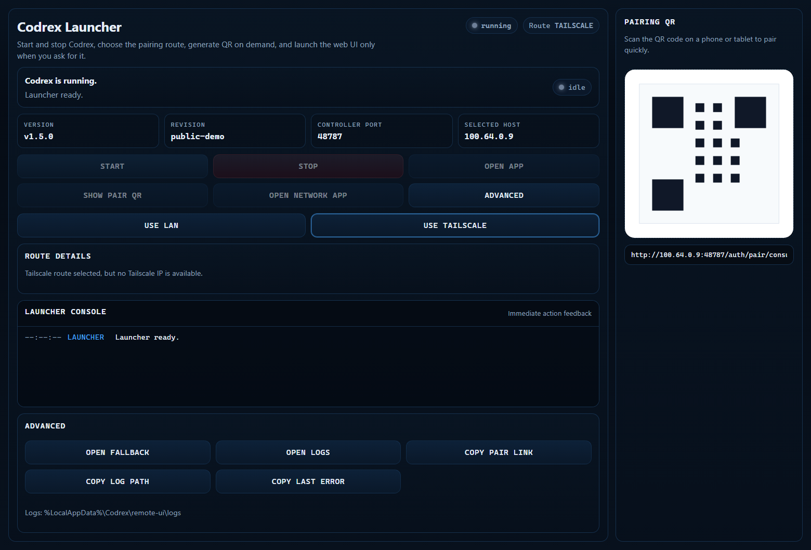

# Codrex


Codrex is a Windows + WSL remote control app for Codex CLI sessions, tmux shells, and remote desktop access from a laptop, phone, or tablet.

It includes:
- a mobile-first web UI
- a Windows launcher
- QR-based pairing for secondary devices
- Codex session and tmux monitoring
- optional Telegram delivery for files and text

Project status and maintenance notes:
- [PROJECT_STATUS.md](PROJECT_STATUS.md)

## Screenshots

### Launcher


### Web UI

#### Sessions


#### Threads


#### Remote


#### Pair


#### Settings


#### Debug


## Quick Start

1. Install Windows prerequisites:
   - Windows 10 or 11
   - WSL2 with an Ubuntu distro
   - Python 3.11+
   - Node.js 20+
   - Git
   - WebView2 runtime is recommended for the Windows launcher
2. Clone the repo:

```powershell
git clone https://github.com/meghamsh738/Codrex.git
Set-Location .\Codrex
```

3. Run first-time setup:

```powershell
.\Setup.cmd
```

4. Start Codrex on later runs:

```powershell
.\Codrex.cmd
```

5. Stop Codrex when you are done:

```powershell
.\tools\windows\stop-mobile.ps1
```

## Beginner Guide

The full setup guide, including WSL configuration, pairing, and Telegram bot setup, is here:

- [docs/setup-beginner.md](docs/setup-beginner.md)

That guide is written for a first-time Windows user and includes:
- how to choose the right WSL work directory
- how to launch the app and open the local UI
- how to pair a phone or tablet
- how to create a Telegram bot with BotFather
- how Codrex discovers or stores the Telegram chat id
- what stays local and should never be committed

## Secrets And Safety

Keep these files local only:
- `%LocalAppData%\Codrex\remote-ui\state\controller.config.local.json`
- `%LocalAppData%\Codrex\remote-ui\secrets\telegram\key.txt`
- `%LocalAppData%\Codrex\remote-ui\secrets\telegram\chat_id.txt`

Do not commit:
- controller auth tokens
- Telegram bot tokens
- Telegram chat ids
- local runtime logs
- screenshots taken from a real private desktop session

## Regenerating Public Screenshots

The repository screenshots are generated from mocked demo data so they do not expose real hosts, sessions, paths, or secrets.

```powershell
Set-Location .\ui
npm install
npm run screenshots:public
```

That command updates:
- `screenshots/launcher-overview.png`
- `screenshots/webui-tab-sessions.png`
- `screenshots/webui-tab-threads.png`
- `screenshots/webui-tab-remote.png`
- `screenshots/webui-tab-pair.png`
- `screenshots/webui-tab-settings.png`
- `screenshots/webui-tab-debug.png`

## Development

Backend checks:

```powershell
python3 -m py_compile app/server.py
python3 -m unittest tests.test_run_wsl_bash
```

Frontend checks:

```powershell
Set-Location .\ui
npm install
npm run lint
npm run typecheck
npm run test
npm run test:e2e
```
